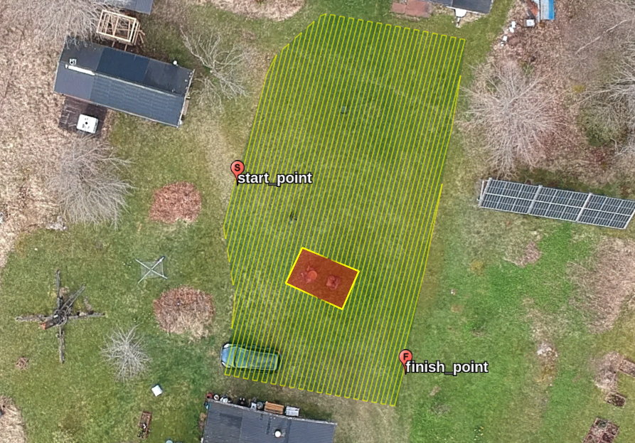

# path_planner

This script generates a boustrophedon (lawnmower pattern) path within specified 
target polygons defined in a KML/KMZ file, while avoiding designated obstacle 
polygons from the same file. It handles coordinate transformations (WGS84 to UTM), 
path generation at a specified angle and separation, obstacle avoidance by 
splitting the path, and stitching the remaining segments together by navigating 
along obstacle boundaries. The final path, along with the target and obstacle 
polygons, is saved to an output KML/KMZ file.

Authors: Peter Lehnér, Gemini-2.5.Pro-03-25
